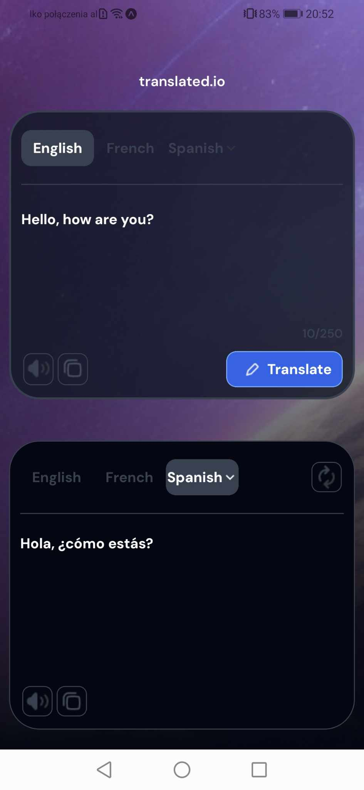

# Translate app implementation from devchallenges.io

- In this app you can translate some words in Polish, French and Spanish. 
- You can also listen to pronunciation of sentences and copy content.
## Technologies

 - React Native expo
 - JS, CSS
 - Translator API from myMemory


## Deployment

To deploy this project run

```bash
  npm install
```
```bash
  npx expo start
```


## Overview

<p float="left">
 
</p>

